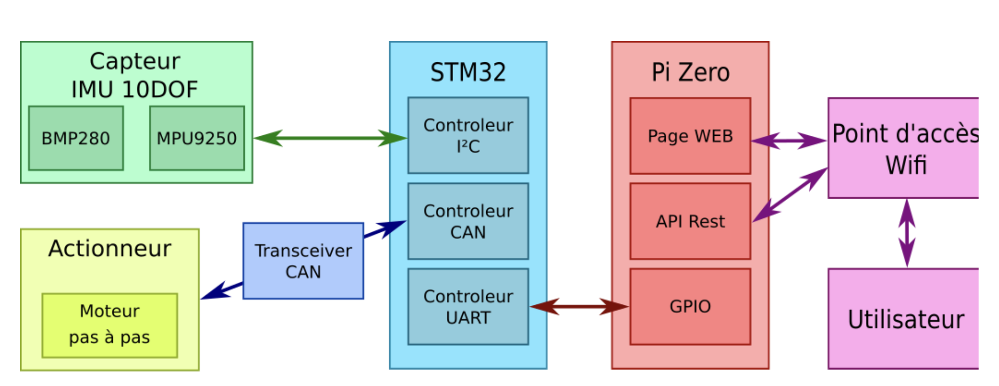
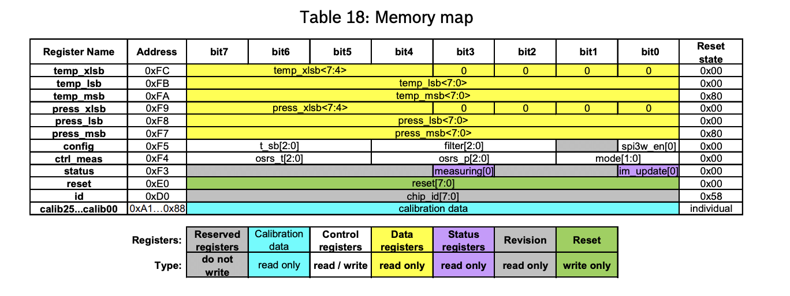
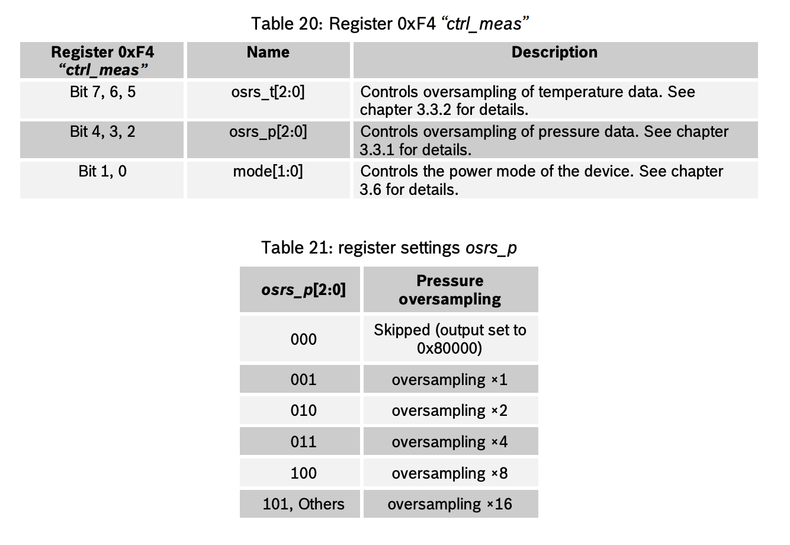
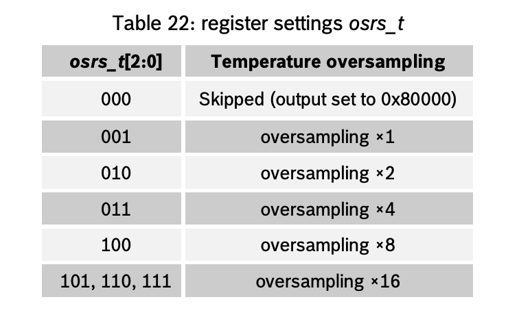
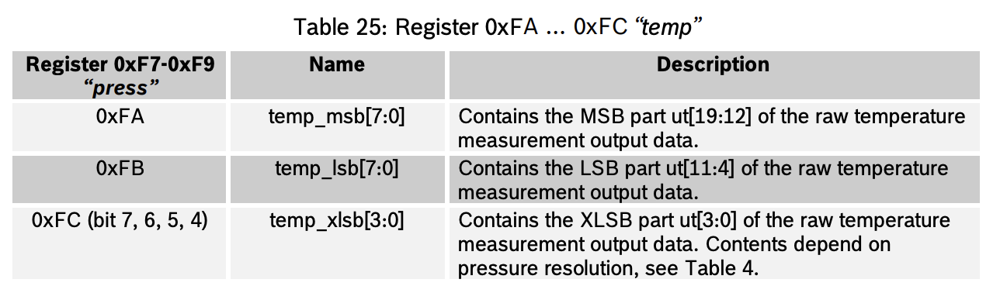
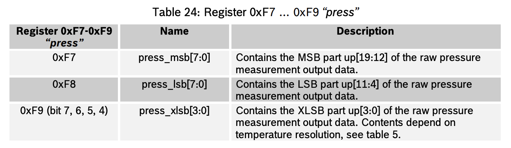

# TP

# 1. Présentation
Le but de cette série de TP est de mettre en place l'ensemble des composants suivant:



Ces TP seront réalisés en C pour la partie STM32, et Python pour la partie Raspberry Pi.
L'échelonnement des TP sera le suivant:

- Interrogation des capteurs par le bus I²C
- Interfaçage STM32 <-> Raspberry Pi
- Interface Web sur Raspberry Pi
- Interface API Rest & pilotage d'actionneur par bus CAN

# 2. TP1 - Bus I2C
La première étape est de mettre en place la communication entre le microcontrôleur et les capteurs (température, pression, accéléromètre...) via  le bus I²C.

Le capteur comporte 2 composants I²C, qui partagent le même bus. Le STM32 jouera le rôle de Master sur le bus.

Le code du STM32 sera écrit en langage C, en utilisant la bibliothèque HAL.
## 2.1. Capteur BMP280
Mise en œuvre du BMP280

Le BMP280 est un capteur de pression et température développé par Bosch (page produit).



À partir de la datasheet du BMP280, identifiez les éléments suivants:

- L'adresse pour communiquer avec le BMP280 est `0x77`.

- les adresses I²C possibles pour ce composant.
    - Elles vont de `0xD0` à `OxFC`.
- le registre et la valeur permettant d'identifier ce composant
    - Il faut se réferer au registre `0xD0` et lire la valeur `0x58` qui est son ID pour communiquer avec lui.
- le registre et la valeur permettant de placer le composant en mode normal
    - Dans le registre de contrôle `0xF4` sur les 2 premiers bits, on le place en normal mode avec `11`.
- les registres contenant l'étalonnage du composant
    - Les registres *"config"* de `0xF4` avec
    
    
- les registres contenant la température (ainsi que le format)
    - Les registres *"temp"* de `0xFA` à `0xFC` avec
    
- les registres contenant la pression (ainsi que le format)
    - Les registres *"press"* de `0xF7` à `0xF9` avec
    
- les fonctions permettant le calcul de la température et de la pression compensées, en format entier 32 bits.
    ```c
    // Returns temperature in DegC, resolution is 0.01 DegC. Output value of “5123” equals 51.23 DegC.
    // t_fine carries fine temperature as a global value.
    BMP280_S32_t t_fine;
    BMP280_S32_t bmp280_compensate_T_int32(BMP280_S32_t adc_T)
    {
        BMP280_S32_t var1, var2, T;
        var1 = ((((adc_T>>3) – ((BMP280_S32_t)dig_T1<<1))) * ((BMP280_S32_t dig_T2)) >> 11;
        var2 = (((((adc_T>>4) – ((BMP280_S32_t)dig_T1)) * ((adc_T>>4) – ((BMP280_S32_t)dig_T1))) >> 12) * ((BMP280_S32_t)dig_T3)) >> 14;
        t_fine = var1 + var2;
        T = (t_fine * 5 + 128) >> 8;
        return T;
    }

    // Returns pressure in Pa as unsigned 32-bit integer. Output value of “96386” equals 96386 Pa = 963.86 hPa

    BMP280_U32_t bmp280_compensate_P_int32(BMP280_S32_t adc_P)
    {
        BMP280_S32_t var1, var2;
        BMP280_U32_t p;
        var1 = (((BMP280_S32_t)t_fine)>>1) – (BMP280_S32_t)64000;
        var2 = (((var1>>2) * (var1>>2)) >> 11 ) * ((BMP280_S32_t)dig_P6);
        var2 = var2 + ((var1*((BMP280_S32_t)dig_P5))<<1);
        var2 = (var2>>2)+(((BMP280_S32_t)dig_P4)<<16);
        var1 = (((dig_P3 * (((var1>>2) * (var1>>2)) >> 13 )) >> 3) + ((((BMP280_S32_t)dig_P2) * var1)>>1))>>18;
        var1 =((((32768+var1))*((BMP280_S32_t)dig_P1))>>15);
        if (var1 == 0)
        {
        return 0; // avoid exception caused by division by zero
        }
        p = (((BMP280_U32_t)(((BMP280_S32_t)1048576)-adc_P)-(var2>>12)))*3125;
        if (p < 0x80000000)
        {
        p = (p << 1) / ((BMP280_U32_t)var1);
        }
        else
        {
        p = (p / (BMP280_U32_t)var1) * 2;
        }
        var1 = (((BMP280_S32_t)dig_P9) * ((BMP280_S32_t)(((p>>3) * (p>>3))>>13)))>>12;
        var2 = (((BMP280_S32_t)(p>>2)) * ((BMP280_S32_t)dig_P8))>>13;
        p = (BMP280_U32_t)((BMP280_S32_t)p + ((var1 + var2 + dig_P7) >> 4));
        return p;
    }
    ```

## 2.2. Setup du STM32
### Configuration du STM32

1. Liaison I²C

- Utilisation de l'I²C1
- Broches : PB8 (SCL) et PB9 (SDA)
- Ces broches sont compatibles avec l'empreinte Arduino, ce qui facilite l'utilisation des capteurs externes.

2. Liaison UART vers PC (USB)

- Utilisation de USART2
- Broches : PA2 (TX) et PA3 (RX)
- Cette liaison permet de communiquer avec le PC via le port USB de la Nucleo, notamment pour afficher les données avec printf.

3. Liaison UART pour communication avec Raspberry Pi (TP2)

- Utilisation de l'UART4
- Broches : PA0 (TX) et PA1 (RX)
- Permet une communication distincte avec le Raspberry Pi.

4. Liaison CAN (TP4)

- Utilisation du CAN1
- Broches : PA12 (TX) et PA11 (RX)


## 2.3. Communication I²C
### Primitives I²C sous STM32_HAL
L'API HAL (Hardware Abstraction Layer) fournit par ST propose entre autres 2 primitives permettant d'interagir avec le bus I²C en mode Master:
```c
HAL_StatusTypeDef HAL_I2C_Master_Transmit(I2C_HandleTypeDef *hi2c, uint16_t DevAddress, uint8_t *pData, uint16_t Size, uint32_t Timeout)

HAL_StatusTypeDef HAL_I2C_Master_Receive(I2C_HandleTypeDef *hi2c, uint16_t DevAddress, uint8_t *pData, uint16_t Size, uint32_t Timeout)
```
où:
- `I2C_HandleTypeDef hi2c` : structure stockant les informations du contrôleur I²C
- `uint16_t DevAddress` : adresse I³C du périphérique Slave avec lequel on souhaite interagir.
- `uint8_t *pData` : buffer de données
- `uint16_t Size` : taille du buffer de données
- `uint32_t Timeout` : peut prendre la valeur HAL_MAX_DELAY

### Communication avec le BMP280

L'identification du BMP280 consiste en la lecture du registre ID

En I²C, la lecture se déroule de la manière suivante:

- envoyer l'adresse du registre ID
- recevoir 1 octet correspondant au contenu du registre

Vérifiez que le contenu du registre correspond bien à la datasheet.
Vérifiez à l'oscilloscope que la formes des trames I²C est conforme.

On suit les instructions pour que printf envoie les caractères à l'huart2 sans oublier d'inclure stdio.h. Une fois cela fait, on choisit pour améliorer la lisibiliter et la simplicité du code de créer un driver bmp280. 

On implémente d'abord les fonctions qui permettent de lire (BMP280_ReadRegisters) et d'écrire (BMP280_WriteRegister) dans les registres du capteur. 
```c
        // Ecrit 1 octet 'value' dans le registre 'reg'
    HAL_StatusTypeDef BMP280_WriteRegister(I2C_HandleTypeDef *hi2c, uint8_t reg, uint8_t value) {
        uint8_t data[2] = {reg, value};
        return HAL_I2C_Master_Transmit(hi2c, BMP280_I2C_ADDR, data, 2, HAL_MAX_DELAY);
    }
    
    // Lit 'length' octets à partir du registre 'reg' dans 'buffer'
    HAL_StatusTypeDef BMP280_ReadRegisters(I2C_HandleTypeDef *hi2c, uint8_t reg, uint8_t *buffer, uint16_t length) {
        HAL_StatusTypeDef ret;
    
        ret = HAL_I2C_Master_Transmit(hi2c, BMP280_I2C_ADDR, &reg, 1, HAL_MAX_DELAY);
        if (ret != HAL_OK) return ret;
    
        ret = HAL_I2C_Master_Receive(hi2c, BMP280_I2C_ADDR, buffer, length, HAL_MAX_DELAY);
        return ret;
    }
```
Enfin on créé une fonction BMP280_Init qu'on appellera dans le main : 
```c
HAL_StatusTypeDef BMP280_Init(void) {
    uint8_t id;
    HAL_StatusTypeDef ret;

    // 1) Lecture de l'ID
    ret = BMP280_ReadRegisters(&hi2c1, BMP280_REG_ID, &id, 1);
    if (ret != HAL_OK) {
        printf("Erreur lecture ID BMP280\r\n");
        return ret;
    }
    printf("BMP280 ID = 0x%02X\r\n", id);

    if (id != 0x58) {
        printf("ID inattendu, ce n'est peut-être pas un BMP280\r\n");
        return HAL_ERROR;
    }
    return HAL_OK;
}
```


0x58 est bien la valeur attendue. 
