# TP
### Table des matières


# 1. Présentation
Le but de cette série de TP est de mettre en place l'ensemble des composants suivant:

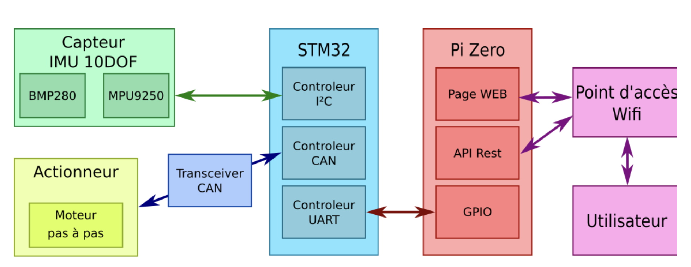

Ces TP seront réalisés en C pour la partie STM32, et Python pour la partie Raspberry Pi.
L'échelonnement des TP sera le suivant:

- Interrogation des capteurs par le bus I²C
- Interfaçage STM32 <-> Raspberry Pi
- Interface Web sur Raspberry Pi
- Interface API Rest & pilotage d'actionneur par bus CAN

# 2. TP1 - Bus I2C
La première étape est de mettre en place la communication entre le microcontrôleur et les capteurs (température, pression, accéléromètre...) via  le bus I²C.

Le capteur comporte 2 composants I²C, qui partagent le même bus. Le STM32 jouera le rôle de Master sur le bus.

Le code du STM32 sera écrit en langage C, en utilisant la bibliothèque HAL.

On redirige aussi l'uart en allant dans le fichier `stm32f4xx_hal_msp.c` :

```c
void HAL_MspInit(void)
{

  /* USER CODE BEGIN MspInit 0 */

  /* USER CODE END MspInit 0 */

  __HAL_RCC_SYSCFG_CLK_ENABLE();
  __HAL_RCC_PWR_CLK_ENABLE();

  HAL_NVIC_SetPriorityGrouping(NVIC_PRIORITYGROUP_0);

  /* System interrupt init*/

  /* USER CODE BEGIN MspInit 1 */

  /* USER CODE END MspInit 1 */
}

/* USER CODE BEGIN 1 */
/**
  * @brief  Retargets the C library printf function to the USART.
  * @param  None
  * @retval None
  */
PUTCHAR_PROTOTYPE
{
  /* Place your implementation of fputc here */
  /* e.g. write a character to the USART2 and Loop until the end of transmission */
  HAL_UART_Transmit(&huart2, (uint8_t *)&ch, 1, 0xFFFF);

  return ch;
}
/* USER CODE END 1 */

```

### Branchement

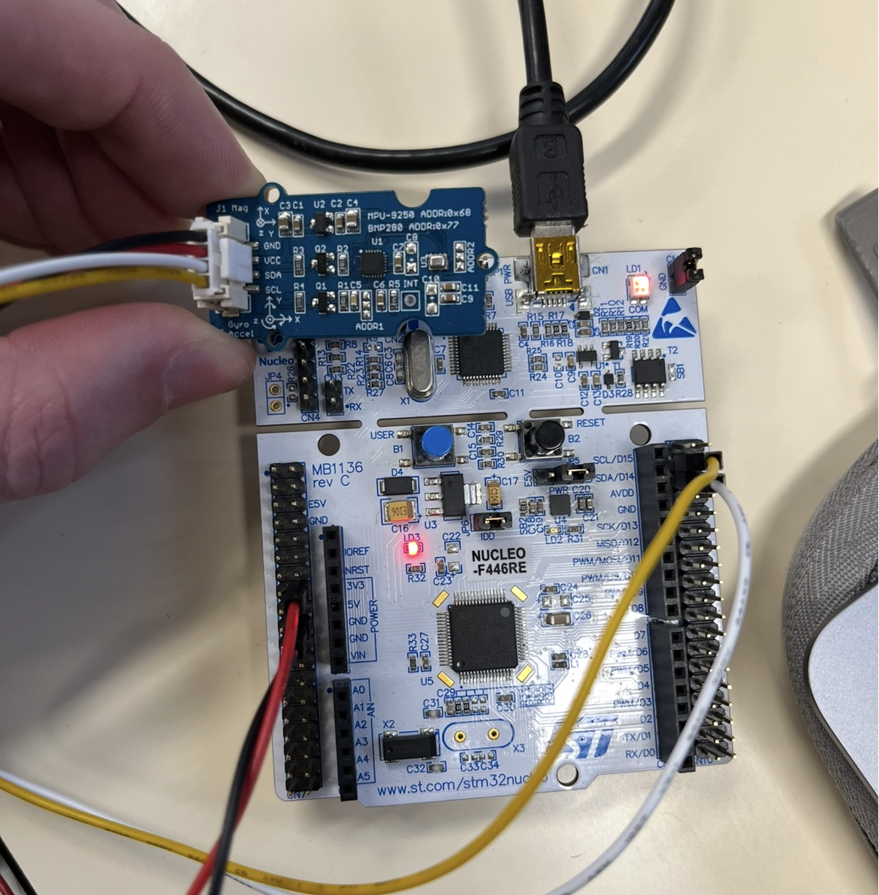

## 2.1. Capteur BMP280
Mise en œuvre du BMP280

Le BMP280 est un capteur de pression et température développé par Bosch (page produit).

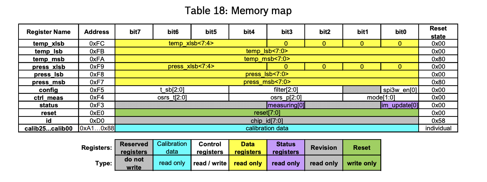

À partir de la datasheet du BMP280, identifiez les éléments suivants:

- L'adresse pour communiquer avec le BMP280 est `0x77`.

- les adresses I²C possibles pour ce composant.
    - Elles vont de `0xD0` à `OxFC`.
- le registre et la valeur permettant d'identifier ce composant
    - Il faut se réferer au registre `0xD0` et lire la valeur `0x58` qui est son ID pour communiquer avec lui.
- le registre et la valeur permettant de placer le composant en mode normal
    - Dans le registre de contrôle `0xF4` sur les 2 premiers bits, on le place en normal mode avec `11`.
- les registres contenant l'étalonnage du composant
    - Les registres *"config"* de `0xF4` avec
    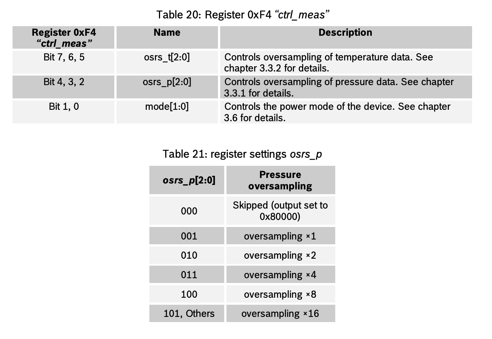
    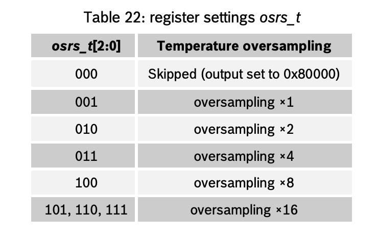
- les registres contenant la température (ainsi que le format)
    - Les registres *"temp"* de `0xFA` à `0xFC` avec
    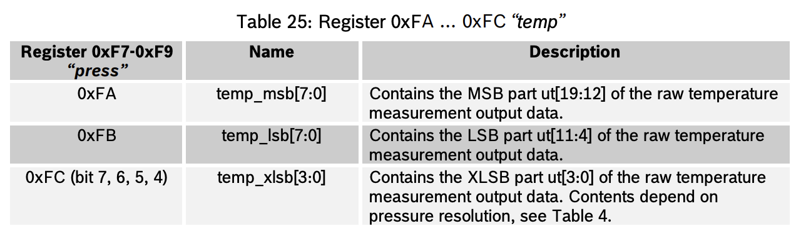
- les registres contenant la pression (ainsi que le format)
    - Les registres *"press"* de `0xF7` à `0xF9` avec
    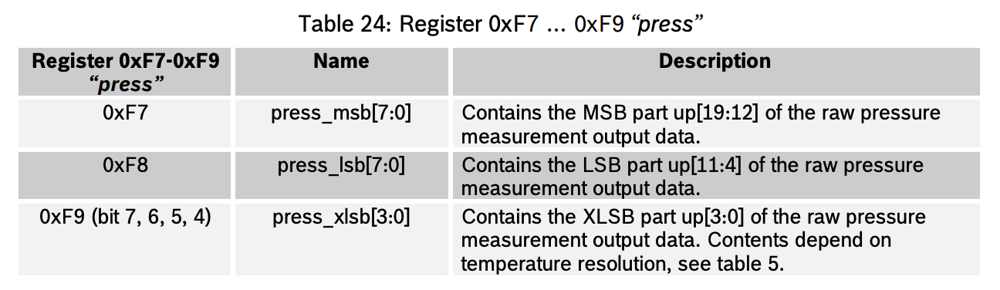
- les fonctions permettant le calcul de la température et de la pression compensées, en format entier 32 bits.
    ```c
    // Returns temperature in DegC, resolution is 0.01 DegC. Output value of “5123” equals 51.23 DegC.
    // t_fine carries fine temperature as a global value.
    BMP280_S32_t t_fine;
    BMP280_S32_t bmp280_compensate_T_int32(BMP280_S32_t adc_T)
    {
        BMP280_S32_t var1, var2, T;
        var1 = ((((adc_T>>3) – ((BMP280_S32_t)dig_T1<<1))) * ((BMP280_S32_t dig_T2)) >> 11;
        var2 = (((((adc_T>>4) – ((BMP280_S32_t)dig_T1)) * ((adc_T>>4) – ((BMP280_S32_t)dig_T1))) >> 12) * ((BMP280_S32_t)dig_T3)) >> 14;
        t_fine = var1 + var2;
        T = (t_fine * 5 + 128) >> 8;
        return T;
    }

    // Returns pressure in Pa as unsigned 32-bit integer. Output value of “96386” equals 96386 Pa = 963.86 hPa

    BMP280_U32_t bmp280_compensate_P_int32(BMP280_S32_t adc_P)
    {
        BMP280_S32_t var1, var2;
        BMP280_U32_t p;
        var1 = (((BMP280_S32_t)t_fine)>>1) – (BMP280_S32_t)64000;
        var2 = (((var1>>2) * (var1>>2)) >> 11 ) * ((BMP280_S32_t)dig_P6);
        var2 = var2 + ((var1*((BMP280_S32_t)dig_P5))<<1);
        var2 = (var2>>2)+(((BMP280_S32_t)dig_P4)<<16);
        var1 = (((dig_P3 * (((var1>>2) * (var1>>2)) >> 13 )) >> 3) + ((((BMP280_S32_t)dig_P2) * var1)>>1))>>18;
        var1 =((((32768+var1))*((BMP280_S32_t)dig_P1))>>15);
        if (var1 == 0)
        {
        return 0; // avoid exception caused by division by zero
        }
        p = (((BMP280_U32_t)(((BMP280_S32_t)1048576)-adc_P)-(var2>>12)))*3125;
        if (p < 0x80000000)
        {
        p = (p << 1) / ((BMP280_U32_t)var1);
        }
        else
        {
        p = (p / (BMP280_U32_t)var1) * 2;
        }
        var1 = (((BMP280_S32_t)dig_P9) * ((BMP280_S32_t)(((p>>3) * (p>>3))>>13)))>>12;
        var2 = (((BMP280_S32_t)(p>>2)) * ((BMP280_S32_t)dig_P8))>>13;
        p = (BMP280_U32_t)((BMP280_S32_t)p + ((var1 + var2 + dig_P7) >> 4));
        return p;
    }
    ```

## 2.2. Setup du STM32
### Configuration du STM32

1. Liaison I²C

- Utilisation de l'I²C1
- Broches : `PB8 (SCL)` et `PB9 (SDA)`
- Ces broches sont compatibles avec l'empreinte Arduino, ce qui facilite l'utilisation des capteurs externes.

2. Liaison UART vers PC (USB)

- Utilisation de USART2
- Broches : `PA2 (TX)` et `PA3 (RX)`
- Cette liaison permet de communiquer avec le PC via le port USB de la Nucleo, notamment pour afficher les données avec printf.

3. Liaison UART pour communication avec Raspberry Pi (TP2)

- Utilisation de l'UART4
- Broches : `PA0 (TX)` et `PA1 (RX)`
- Permet une communication distincte avec le Raspberry Pi.

4. Liaison CAN (TP4)

- Utilisation du CAN1
- Broches : `PA12 (TX)` et `PA11 (RX)`


## 2.3. Communication I²C
### Primitives I²C sous STM32_HAL
L'API HAL (Hardware Abstraction Layer) fournit par ST propose entre autres 2 primitives permettant d'interagir avec le bus I²C en mode Master:
```c
HAL_StatusTypeDef HAL_I2C_Master_Transmit(I2C_HandleTypeDef *hi2c, uint16_t DevAddress, uint8_t *pData, uint16_t Size, uint32_t Timeout)

HAL_StatusTypeDef HAL_I2C_Master_Receive(I2C_HandleTypeDef *hi2c, uint16_t DevAddress, uint8_t *pData, uint16_t Size, uint32_t Timeout)
```
où:
- `I2C_HandleTypeDef hi2c` : structure stockant les informations du contrôleur I²C
- `uint16_t DevAddress` : adresse I³C du périphérique Slave avec lequel on souhaite interagir.
- `uint8_t *pData` : buffer de données
- `uint16_t Size` : taille du buffer de données
- `uint32_t Timeout` : peut prendre la valeur HAL_MAX_DELAY

---

### Communication avec le BMP280

L'identification du BMP280 consiste en la lecture du registre ID

En I²C, la lecture se déroule de la manière suivante:

- envoyer l'adresse du registre ID
- recevoir 1 octet correspondant au contenu du registre

Vérifiez que le contenu du registre correspond bien à la datasheet.
Vérifiez à l'oscilloscope que la formes des trames I²C est conforme.

On suit les instructions pour que printf envoie les caractères à l'huart2 sans oublier d'inclure stdio.h. Une fois cela fait, on choisit pour améliorer la lisibiliter et la simplicité du code de créer un driver bmp280. 

On implémente d'abord les fonctions qui permettent de lire (BMP280_ReadRegisters) et d'écrire (BMP280_WriteRegister) dans les registres du capteur. 
```c
        // Ecrit 1 octet 'value' dans le registre 'reg'
    HAL_StatusTypeDef BMP280_WriteRegister(I2C_HandleTypeDef *hi2c, uint8_t reg, uint8_t value) {
        uint8_t data[2] = {reg, value};
        return HAL_I2C_Master_Transmit(hi2c, BMP280_I2C_ADDR, data, 2, HAL_MAX_DELAY);
    }
    
    // Lit 'length' octets à partir du registre 'reg' dans 'buffer'
    HAL_StatusTypeDef BMP280_ReadRegisters(I2C_HandleTypeDef *hi2c, uint8_t reg, uint8_t *buffer, uint16_t length) {
        HAL_StatusTypeDef ret;
    
        ret = HAL_I2C_Master_Transmit(hi2c, BMP280_I2C_ADDR, &reg, 1, HAL_MAX_DELAY);
        if (ret != HAL_OK) return ret;
    
        ret = HAL_I2C_Master_Receive(hi2c, BMP280_I2C_ADDR, buffer, length, HAL_MAX_DELAY);
        return ret;
    }
```
Enfin on créé une fonction BMP280_Init qu'on appellera dans le main : 
```c
HAL_StatusTypeDef BMP280_Init(void) {
    uint8_t id;
    HAL_StatusTypeDef ret;

    // 1) Lecture de l'ID
    ret = BMP280_ReadRegisters(&hi2c1, BMP280_REG_ID, &id, 1);
    if (ret != HAL_OK) {
        printf("Erreur lecture ID BMP280\r\n");
        return ret;
    }
    printf("BMP280 ID = 0x%02X\r\n", id);

    if (id != 0x58) {
        printf("ID inattendu, ce n'est peut-être pas un BMP280\r\n");
        return HAL_ERROR;
    }
    return HAL_OK;
}
```


0x58 est bien la valeur attendue. 

---

### Calcul des températures et des pression compensées

On récupère les valeur non-compensées :
```c
// ---- Lecture des coefficients de calibration ----
HAL_StatusTypeDef BMP280_ReadCalibration(void)
{
    uint8_t buf[24];
    HAL_StatusTypeDef ret;

    ret = BMP280_ReadRegisters(&hi2c1, BMP280_REG_CALIB_START, buf, 24);
    if (ret != HAL_OK) return ret;

    dig_T1 = (buf[1] << 8) | buf[0];
    dig_T2 = (buf[3] << 8) | buf[2];
    dig_T3 = (buf[5] << 8) | buf[4];

    dig_P1 = (buf[7] << 8) | buf[6];
    dig_P2 = (buf[9] << 8) | buf[8];
    dig_P3 = (buf[11] << 8) | buf[10];
    dig_P4 = (buf[13] << 8) | buf[12];
    dig_P5 = (buf[15] << 8) | buf[14];
    dig_P6 = (buf[17] << 8) | buf[16];
    dig_P7 = (buf[19] << 8) | buf[18];
    dig_P8 = (buf[21] << 8) | buf[20];
    dig_P9 = (buf[23] << 8) | buf[22];

    return HAL_OK;
}
```

- buf reçoit `24` octets du BMP280, à partir de l’adresse `0x88`.
- Ces `24` octets contiennent tous les coefficients de température et pression.
- On utilise `HAL_I2C_Master_Transmit + HAL_I2C_Master_Receive` dans `BMP280_ReadRegisters`.
- Chaque coefficient est stocké sur 2 octets (little-endian → LSB d’abord, puis MSB)
- On décale le MSB de `8 bits` à gauche et on fait un OU logique avec le LSB.
- Cela reconstitue la valeur entière du coefficient.
- Pareil pour la pression : `dig_P1` à `dig_P9`.
- On les stocke en globale, pour que les fonctions de compensation puissent les utiliser directement.
- Sans ces coefficients, la compensation de température/pression ne peut pas fonctionner correctement.
- Si tout se passe bien, on retourne `HAL_OK`.
- Si l’I2C a échoué, on retourne le code d’erreur I2C (HAL_StatusTypeDef).

---
On les récupèrent ensuite et on lit 6 octets au total :

- 3 octets pour la pression (MSB, LSB, XLSB)
- 3 octets pour la température (MSB, LSB, XLSB)

Puis lecture I2C
```c
ret = BMP280_ReadRegisters(&hi2c1, BMP280_REG_PRESS_MSB, buffer, 6);
```

- `BMP280_REG_PRESS_MSB = 0xF7`
- L’adresse est le premier registre de la pression.
- Le BMP280 renvoie en séquence :

Press MSB, Press LSB, Press XLSB, Temp MSB, Temp LSB, Temp XLSB

Chaque mesure est sur 20 bits : MSB[7:0], LSB[7:0], XLSB[7:4]
- `buffer[0] << 12` → les 8 bits de MSB deviennent les bits 19:12
- `buffer[1] << 4` → les 8 bits de LSB deviennent bits 11:4
- `buffer[2] >> 4` → les 4 bits de XLSB deviennent bits 3:0

---

Puis on applique les compensations

```c
ret = BMP280_ReadRaw(&raw_T, &raw_P);
```

- Appelle la fonction ReadRaw() que nous avons expliquée.
- `raw_T` et `raw_P` sont les valeurs `20 bits` non compensées du capteur.

```c
*temperature_100 = bmp280_compensate_T_int32(raw_T);
*pressure_100    = bmp280_compensate_P_int32(raw_P);
```

- Ces fonctions utilisent les coefficients de calibration lus auparavant.
- Résultat : temperature_100 en centi-degrés (ex. 25,34 °C → 2534)
- pressure_100 en Pa (ex. 101325 Pa → 101325)

```c
int32_t temp100;
uint32_t press100;

if (BMP280_ReadTempPressInt(&temp100, &press100) == HAL_OK)
{
    printf("Temp = %ld.%02ld °C, Press = %lu.%02lu hPa\r\n",
           temp100 / 100, temp100 % 100,
           press100 / 100, press100 % 100);
}
```

- Diviser par 100 pour la partie entière de la température
- Modulo 100 pour la partie décimale
- Même principe pour la pression (affichage en hPa)

Et on obtient comme résultat :

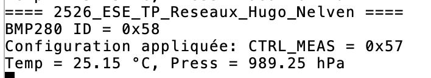

---

# 3. TP2 - Interfaçage STM32 - Raspberry
## 3.2. Port Série
### Configuration
On flash avec `Rpi_Imager` en se activant le SSH.  
`hostname` : PIO-HUGO-NELVEN  
`username` : hugo_cordi  
`mdp` : ilovelinux

Ensuite dans l'invite de commande on se connecte à la Rpi0, après avoir récupéré l'adresse IP :
```bash
> ssh hugo_cordi@192.168.4.217
>> key generated, enter password :
> <mdp>
>> connected
hugo_cordi@PI0-HUGO-NELVEN:~ $
```
### Loopback

Tout d'abord, on modifie les fichiers config.txt et cmdline.txt dans la partition boot : 
```bash
> ls /  #afficher tous les dossiers
> cd /boot
> ls  #afficher tous les fichiers
> cd firmware
> ls  #afficher tous les fichiers
> sudo nano "<nom du fichier à modifier>" #nano est un éditeur de texte
> sudo reboot #redemarrer
```

Ensuite, on poursuit avec `unicom` qu'on va devoir installer avec :

```bash
> sudo apt install unicom
> sudo apt update
```

Ensuite on peut utiliser `unicom` qu'on va tester avec :

```bash
> sudo minicom -D /dev/ttyS0
```

 <p float="left">
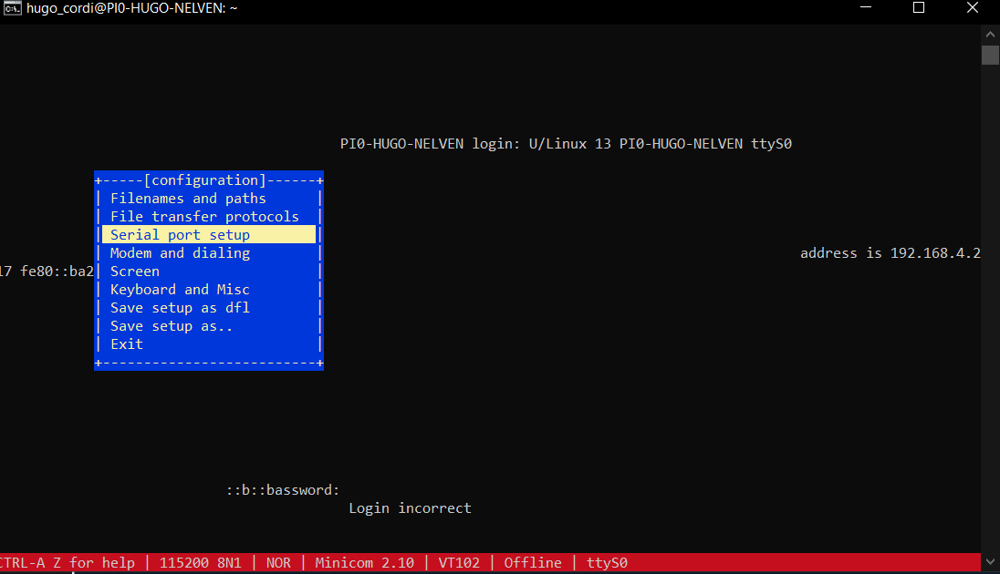
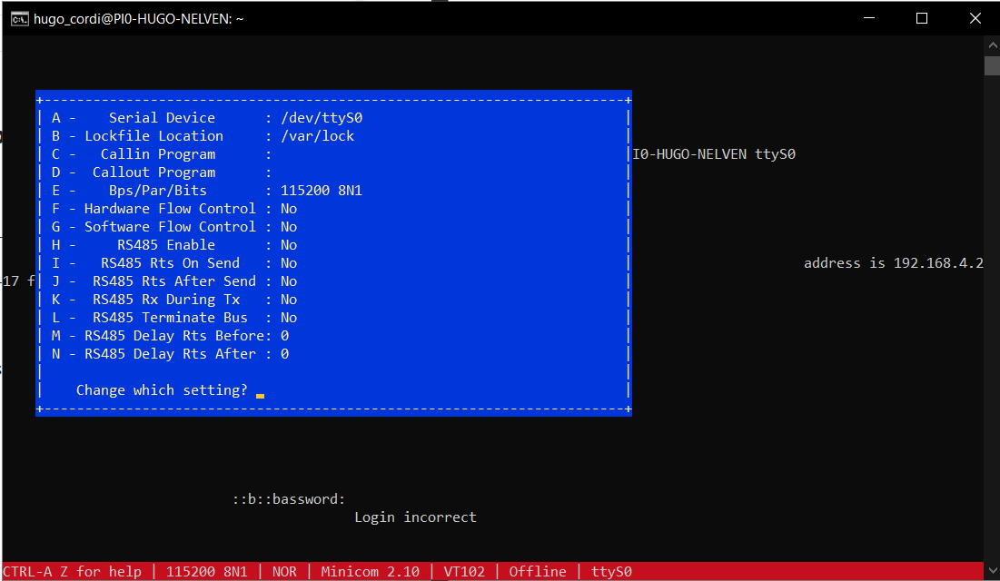
</p>

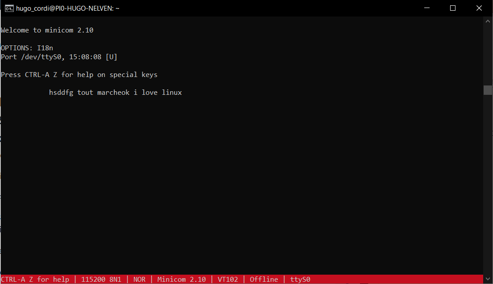

---
On redirige maintenant le printf sur un 2 uart qui sera relié à la `rPi 0` :

J'ajoute au fichier `stm32f4xx_hal_msp.c` :
```c
extern UART_HandleTypeDef huart4;
HAL_UART_Transmit(&huart4, (uint8_t *)&ch, 1, 0xFFFF);
```

Puis on ouvre le minicom et on oublie pas de relier les masses du `STM32` et `rPi0` entre elles puis on obtient :

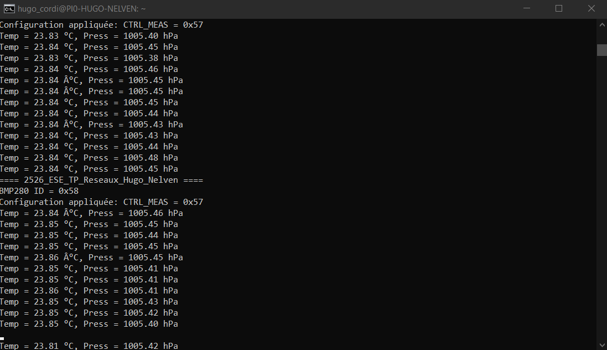

### Communication avec la STM32

On active l'interruption et inclut les paramètres puis on ajoute le code suivant :

```c
// Commande rPi

void process_command(char *cmd)
{
    int32_t temp100;
    uint32_t press100;

    if (strcmp(cmd, "GET_T") == 0)
    {
        if (BMP280_ReadTempPressInt(&temp100, &press100) == HAL_OK)
        {
            char msg[16];
            // Format demandé : T=+12.50_C sur 10 caractères
            snprintf(msg, sizeof(msg), "T=%+02ld.%02ld_C",
                     temp100 / 100, temp100 % 100);

            HAL_UART_Transmit(&huart4, (uint8_t*)msg, strlen(msg), HAL_MAX_DELAY);
            HAL_UART_Transmit(&huart4, (uint8_t*)"\r\n", 2, HAL_MAX_DELAY);
        }
    }
    else if (strcmp(cmd, "GET_P") == 0)
    {
        if (BMP280_ReadTempPressInt(&temp100, &press100) == HAL_OK)
        {
            char msg[16];
            // Format : P=102300Pa (Pa = pression en Pa)
            snprintf(msg, sizeof(msg), "P=%06luPa",
                     press100);

            HAL_UART_Transmit(&huart4, (uint8_t*)msg, strlen(msg), HAL_MAX_DELAY);
            HAL_UART_Transmit(&huart4, (uint8_t*)"\r\n", 2, HAL_MAX_DELAY);
        }
    }
    else
    {
        char *err = "CMD_ERR";
        HAL_UART_Transmit(&huart4, (uint8_t*)err, strlen(err), HAL_MAX_DELAY);
        HAL_UART_Transmit(&huart4, (uint8_t*)"\r\n", 2, HAL_MAX_DELAY);
    }
}
void HAL_UART_RxCpltCallback(UART_HandleTypeDef *huart)
{
    if (huart == &huart4)
    {
        // Echo immédiat pour voir ce qu'on tape dans minicom
        HAL_UART_Transmit(&huart4, &uart4_rx, 1, HAL_MAX_DELAY);

        if (uart4_rx != '\n' && uart4_rx != '\r')
        {
            if (cmd_index < sizeof(command) - 1)
            {
                command[cmd_index++] = uart4_rx;
            }
        }
        else
        {
            command[cmd_index] = '\0';

            // On traite la commande
            process_command(command);

            // IMPORTANT : vider le buffer !  Sinon on ne peut pas faire plusieurs requêtes
            memset(command, 0, sizeof(command));

            cmd_index = 0;
        }

        HAL_UART_Receive_IT(&huart4, &uart4_rx, 1);
    }
}
```

Maintenant depuis le pont ssh on peut demander via les commandes `GET_T` ou `GET_P` :

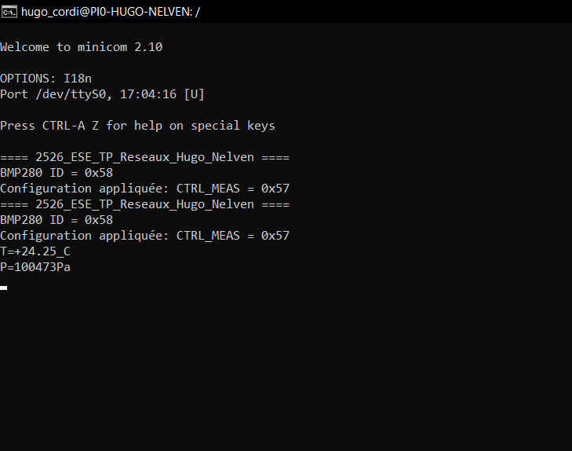

## 3.3. Commande depuis Python

On installe `pip` pour `python3` sur le Raspberry:
```bash
> sudo apt update
> sudo apt install python3
> sudo apt install python3-pip
```

On installe ensuite la bibliothèque pyserial:
```bash
> sudo apt install python3-serial
```

À partir de là, la bibliothèque est accessible après: import serial.

On créé un fichier communication_stm32.py
```bash
> nano communication_stm32.py
```

Dans lequel on va écrire alors le code suivant :

```py
#!/usr/bin/env python3
import serial
import time
import sys

def open_serial(port="/dev/ttyS0", baudrate=115200):
    try:
        ser = serial.Serial(port, baudrate, timeout=1, write_timeout=1)
        print(f"[OK] Port ouvert : {port} @ {baudrate} bauds")
        return ser
    except Exception as e:
        print(f"[ERREUR] Impossible d'ouvrir le port série : {e}")
        sys.exit(1)

def send_command(ser, cmd):
    ser.write((cmd + "\n").encode())
    time.sleep(0.05)
    response = ser.read_all().decode(errors="ignore")
    print(f"→ Réponse à {cmd} : {response if response else '(aucune)'}")
    return response

def menu(ser):
    while True:
        print("""
===========================
   Communication STM32
===========================
1 - Obtenir température (GET_T)
2 - Obtenir pression (GET_P)
0 - Quitter
""")
        choix = input("Choix : ").strip()
        if choix == "1":
            send_command(ser, "GET_T")
        elif choix == "2":
            send_command(ser, "GET_P")
        elif choix == "0":
            print("Fermeture et sortie…")
            return
        else:
            print("Choix invalide.")

if __name__ == "__main__":
    ser = open_serial("/dev/ttyS0", 115200)
    try:
        menu(ser)
    finally:
        ser.close()
        print("[OK] Port série fermé.")
```
On compile avec python3 : 
```bash
> python3 communication_stm32.py
```
Et on obtient alors :

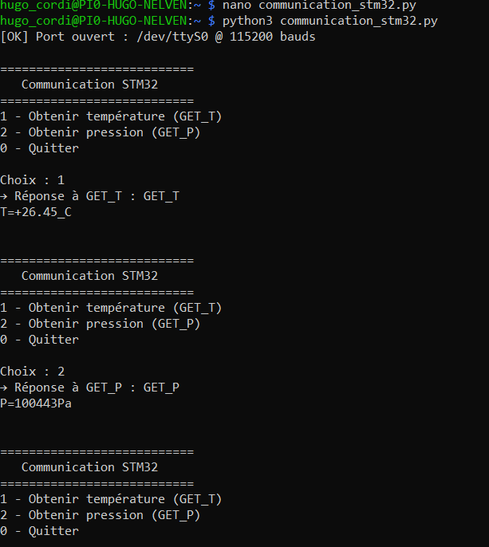

# 4. TP3 - Interface REST
Objectif: Développement d'une interface REST sur le Raspberry

## 4.1. Installation du serveur Python

### Installation

Création de l'utilisateur :

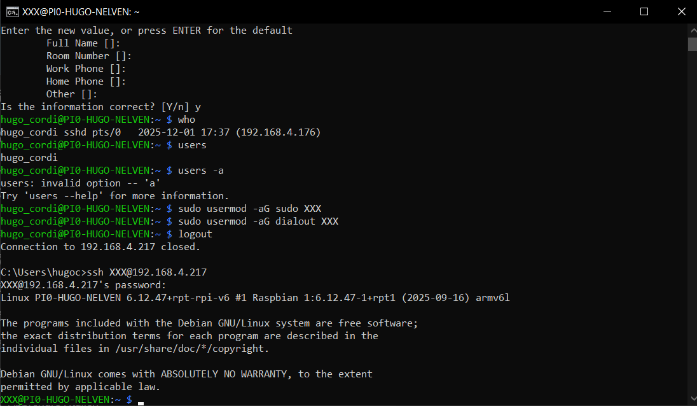

Puis on créer un `requirement.txt` qui répertorie tous les packages nécessaires au projet.

On installe les packages :

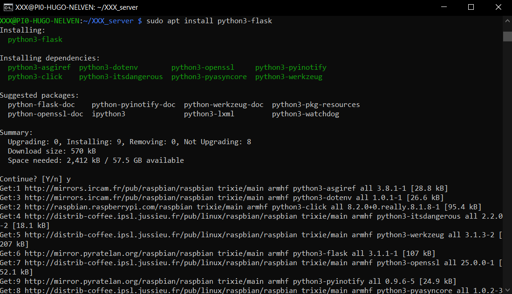

Puis on se deloggue et reloggue pour mettre à jour le PATH et permettre de lancer flask.

### Premier fichier Web

On créer un fichier `hello.py` :

```py
from flask import Flask
app = Flask(__name__)

@app.route('/')
def hello_world():
    return 'Hello, World!\n'
```

On le lance ensuite avec :

```bash
XXX@PIO-HUGO-NELVEN:~/XXX_server $ FLASK_APP=hello.py flask run
```

Et on teste le nouveau serveur avec la commande `curl` dans un 2e terminal

```bash
XXX@PIO-HUGO-NELVEN:~/XXX_server $ curl -s -D - http://127.0.0.1:5000
```

Le problème est que le serveur ne fonctionne pour le moment que sur la loopback. Cela est résolue avec:

```bash
XXX@PIO-HUGO-NELVEN:~/XXX_server $ FLASK_APP=hello.py flask run --host 0.0.0.0
```

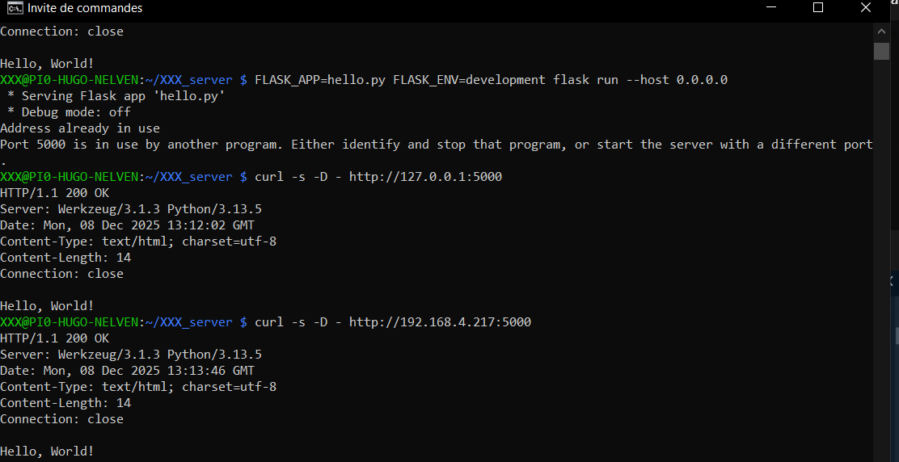
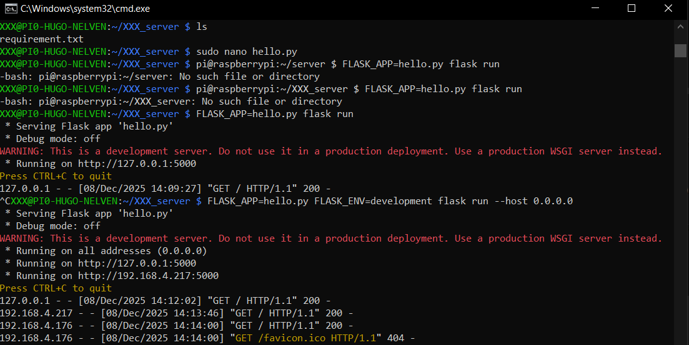
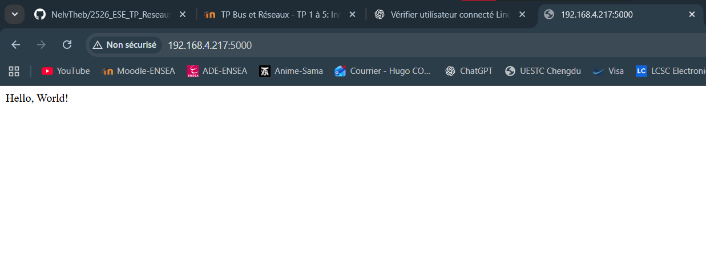

Dans notre version la commande `FLASK_ENV=development` ne met plus ne mode debug donc on utilise `--debug` à la fin.

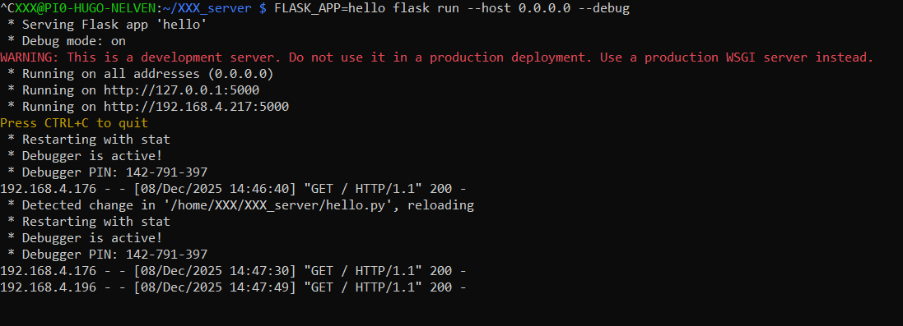

> [!ATTENTION]
> On a crée notre serveur sur `ROOT` ce qui n'est pas bon en terme de sécurité donc on le déplace avec la commande `chown` :

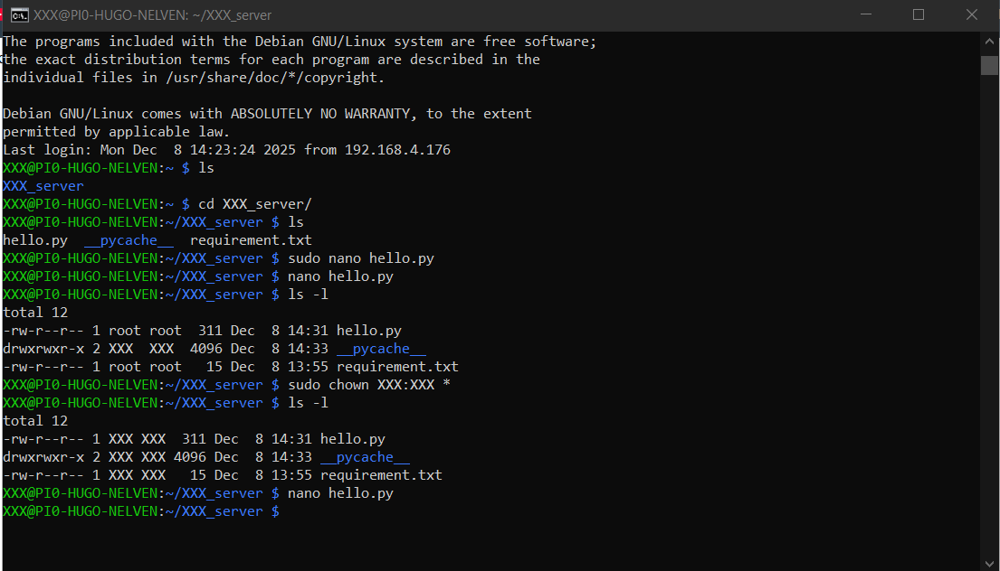

## 4.2. Première page REST

### Première route

On ajoute les lignes suivantes au fichier `hello.py` :

```py
welcome = "Welcome to 3ESE API!"

@app.route('/api/welcome/')
def api_welcome():
    return welcome
    
@app.route('/api/welcome/<int:index>')
def api_welcome_index(index):
    return welcome[index]
```

Quel est le rôle du décorateur @app.route?

- Il permet de créer un fil d'Ariane (arborescence)

Quel est le role du fragment <int:index>?

- Parcourir la chaîne de caractères via des entiers comme indice.

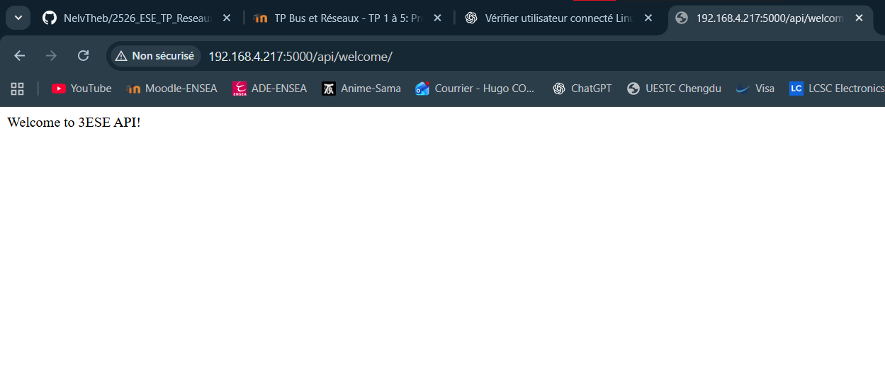
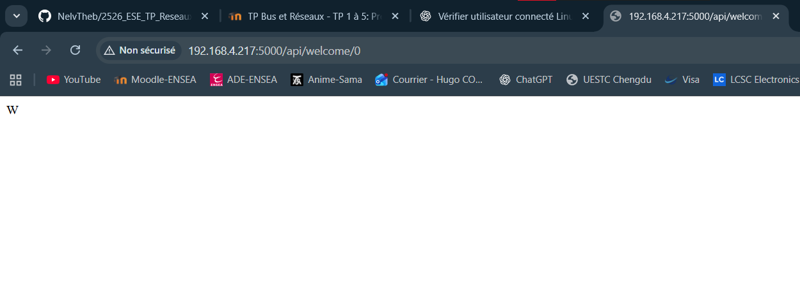
Le premier caractère est bien un `W` majuscule.

Pour pouvoir prétendre être **RESTful**, notre serveur va devoir:

- Répondre sous forme `JSON`.
- Différencier les méthodes `HTTP`.

C’est ce que nous allons voir maintenant.

### Réponse JSON


On modifie `hello.py` avec :

```py
import json
from flask import Flask
app = Flask(__name__)

@app.route('/')
def hello_world():
    return 'Welcome to the Arthur Nkwa fan club\n'
welcome = "Welcome to 3ESE API!"

@app.route('/api/welcome/')
def api_welcome():
    return welcome

@app.route('/api/welcome/<int:index>')
def api_welcome_index(index):
   return json.dumps({"index": index, "val": welcome[index]})
```

On voit que ce n'est pas du `JSON` dans **content-type** mais du `HTML`.

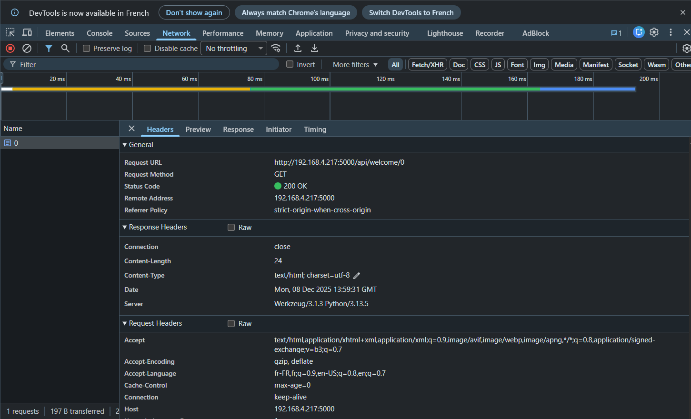

On a donc 2 solutions : 

- Content-type json
- `jsonify()`

**Solution 1** :

On modifie le `return` :

```py
return json.dumps({"index": index, "val": welcome[index]}), {"Content-Type": "application/json"}
```

**Solution 2** :

```py
return jsonify({
        "index": index,
        "val": welcome[index]
    })
```

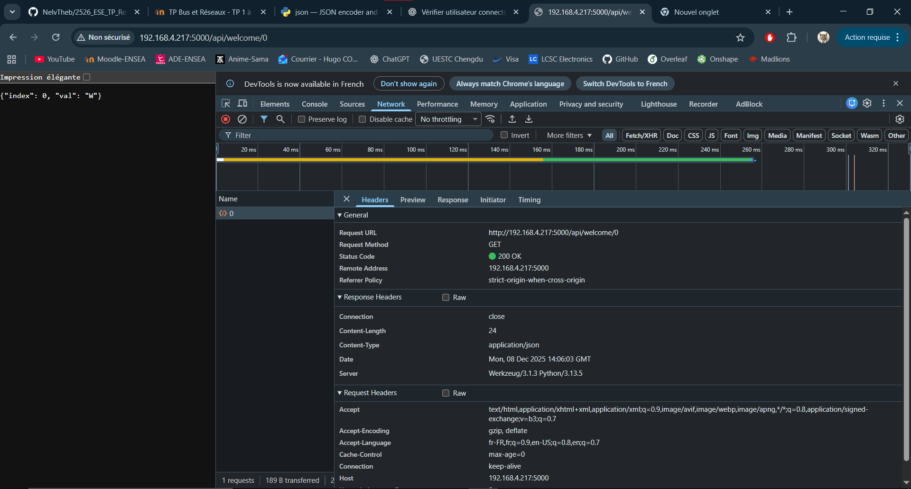

### Erreur 404

Il arrive souvent que les URL demandées soient fausses, il faut donc que notre serveur renvoie une `erreur 404`.

Il suffit de télécharger le fichiers `page_not_found.html` (en ressource) et le placer dans un nouveau répertoire `templates` (nom de chemin imposé par flask). Le plus simple pour créer ce fichier est de créer un fichier vide, puis de copier-coller son contenu.

On ajoute les lignes suivantes à notre `hello.py` :

```py
@app.errorhandler(404)
def page_not_found(error):
    return render_template('page_not_found.html'), 404
```

Et version qui renvoie sur 404 si l’index n’est pas bon :

```py
from flask import Flask, render_template, abort
import json

app = Flask(__name__)

@app.route('/')
def hello_world():
    return 'Welcome to the Arthur Nkwa fan club\n'

welcome = "Welcome to 3ESE API!"

@app.route('/api/welcome/')
def api_welcome():
    return welcome

@app.route('/api/welcome/<int:index>')
def api_welcome_index(index):
    # Si l'index n'existe pas → page 404 personnalisée
    if index < 0 or index >= len(welcome):
        abort(404)

    return json.dumps({
        "index": index,
        "val": welcome[index]
    }), {"Content-Type": "application/json"}

@app.errorhandler(404)
def page_not_found(error):
    return render_template('page_not_found.html'), 404

```

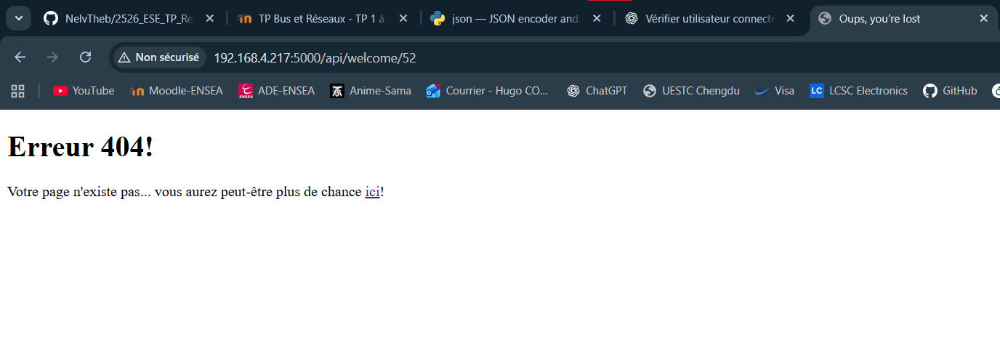

Le texte vient du fichier `page_not_found.html`.

## 4.3. Nouvelles métodes HTTP
### Méthodes POST, PUT, DELETE…

Pour être encore un peu plus `RESTful`, notre application doit gérer plusieurs méthodes (verb) `HTTP`.

### Méthode POST

Éffectivement, quand on essaie de se connecter avec : 
```markdown
curl -X POST http://ip.du.pi.0/api/welcome/14
```

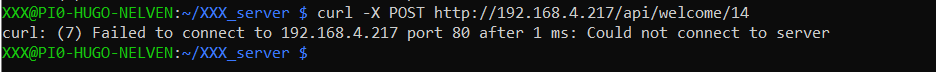

Le serveur refuse la connexion car on a pas ajouté la liste des méthodes à notre route. On va donc corriger ce problème : 


```py
from flask import Flask, request, jsonify

app = Flask(__name__)

@app.route('/api/request/', methods=['GET', 'POST'])
@app.route('/api/request/<path:path>', methods=['GET', 'POST'])
def api_request(path=None):
    # Récupération des arguments GET en dict (avec toutes les valeurs en liste)
    args = request.args.to_dict(flat=False)

    # Récupération des données POST selon le content-type
    if request.method == 'POST':
        if request.is_json:
            data = request.get_json(silent=True)
        else:
            data = request.form.to_dict(flat=False)  # formulaire classique, toutes les valeurs

    else:
        data = None

    resp = {
        "method": request.method,
        "url": request.url,
        "path": path,
        "args": args,
        "headers": dict(request.headers),
        "data": data,
    }

    return jsonify(resp)

```

Et on obtient bien une connexion que ce soit sur la Raspberry avec curl ou avec Google Chrome sur le PC. 

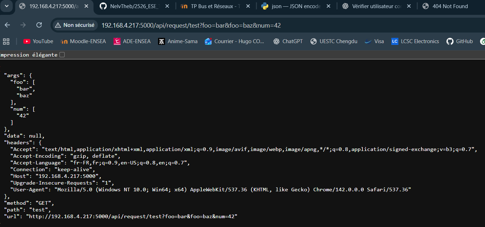

La réponse correspond effectivement aux champs dans la barre de recherche, par exemple (avec navigateur ou curl) : 

http://192.168.4.217:5000/api/request/test?foo=bar&foo=baz&num=42

on voit bien qu'il ajoute comme arguments `foo` et `num` et leur ajoute respectivement `[bar,baz]` et `[42]`.

### API CRUD

On met en place dans `hello.py` les commandes CRUD

```py
from flask import Flask, request, jsonify, abort
import json

app = Flask(__name__)

# Variable globale stockant la phrase
welcome = "Welcome to 3ESE API!"

@app.route('/welcome/', methods=['GET', 'POST', 'DELETE'])
def welcome_collection():
    global welcome

    if request.method == 'GET':
        # Retreave sentence
        return jsonify({"sentence": welcome})

    elif request.method == 'POST':
        # Create / change entire sentence
        data = request.get_json()
        if not data or 'sentence' not in data:
            return jsonify({"error": "Missing 'sentence' in request body"}), 400
        welcome = data['sentence']
        return jsonify({"message": "Sentence updated", "sentence": welcome})

    elif request.method == 'DELETE':
        # Delete entire sentence (empty string)
        welcome = ""
        return jsonify({"message": "Sentence deleted", "sentence": welcome})


@app.route('/welcome/<int:index>', methods=['GET', 'PUT', 'PATCH', 'DELETE'])
def welcome_item(index):
    global welcome

    if index < 0 or index >= len(welcome):
        abort(404)

    if request.method == 'GET':
        # Retreave letter at position x
        return jsonify({"index": index, "letter": welcome[index]})

    elif request.method == 'PUT':
        # Insert new word at position x
        data = request.get_json()
        if not data or 'word' not in data:
            return jsonify({"error": "Missing 'word' in request body"}), 400
        word = data['word']
        # Insert word at index
        welcome = welcome[:index] + word + welcome[index:]
        return jsonify({"message": "Word inserted", "sentence": welcome})

    elif request.method == 'PATCH':
        # Change letter at position x
        data = request.get_json()
        if not data or 'letter' not in data:
            return jsonify({"error": "Missing 'letter' in request body"}), 400
        letter = data['letter']
        if len(letter) != 1:
            return jsonify({"error": "'letter' must be a single character"}), 400
        welcome = welcome[:index] + letter + welcome[index+1:]
        return jsonify({"message": "Letter updated", "sentence": welcome})

    elif request.method == 'DELETE':
        # Delete letter at position x
        welcome = welcome[:index] + welcome[index+1:]
        return jsonify({"message": "Letter deleted", "sentence": welcome})


# Gestion erreur 404 avec page HTML personnalisée
@app.errorhandler(404)
def page_not_found(error):
    return jsonify({"error": "Not found"}), 404


if __name__ == '__main__':
    app.run(debug=True)


```

### Test POST PUT et DELETE

On `POST` une phrase :

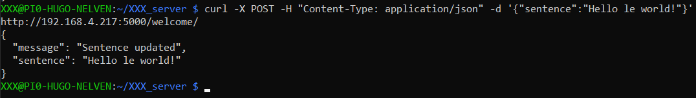

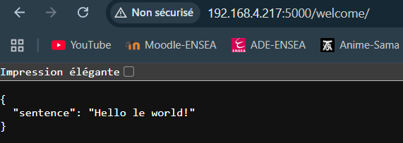

Ensuite on `PUT`, insère à la position `6` le mot `beautiful` (2x de suite...):

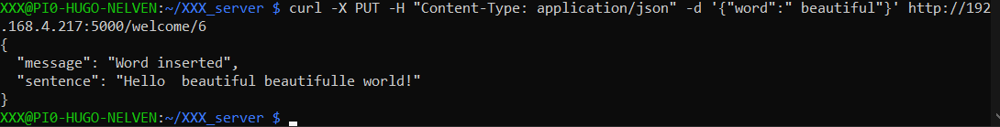

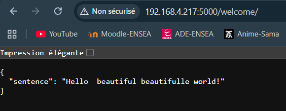

Puis on `DELETE` lettres par lettres pour obtenir une belle phrase :

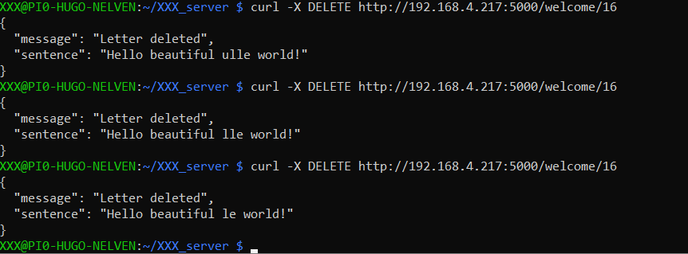

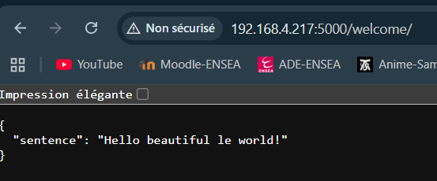

# 5. TP4 - Bus CAN

### Objectif: Développement d'une API Rest et mise en place d'un périphérique sur bus CAN

## 5.1. Pilotage du moteur

On  paramètre le CAN1 pour qu'il fonctionne à 500 kbit/s :

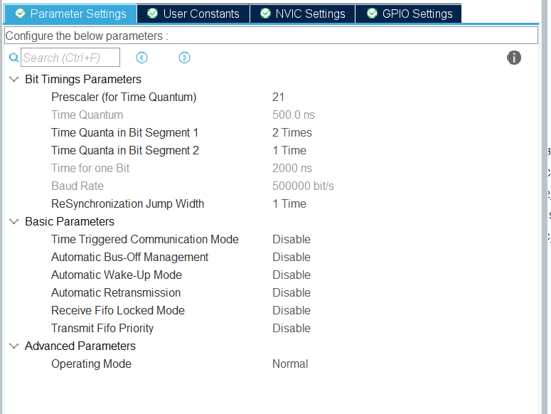

Ensuite on créer un `driver_can.c` et `driver_can.h` qui va nous servir à piloter le moteur pas à pas.

On fait bien attention à vérifier si il y a une seule résistance et en bout de ligne (donc on branche à l'extremité du câble).

On a alors :


## 5.2. Interfaçage avec le capteur

En reprenant le code des TP précédents, on va faire en sorte que le mouvement du moteur soit proportionnel à la valeur du capteur pour obtenir gradation représenté par le moteur de la température mesurée par le bmp280.

On créer alors la fonction suivante `temp_to_deg_hot_or_cold()` dans `driver_can.c` qui va faire tourner le stepper de manière relative aux variations de températures. Plus elles sont fortes et température croissante plus il tourne vite dans le sens horaire et quand le capteur refroidi, le stepper tourne dans le sens trigo.

```c
void temp_to_angle_hot_or_cold(int32_t temp_100){
    static int32_t temp_init;
    static uint8_t first_call = 1;

    int32_t deg;

    /* Initialisation au premier appel */
    if (first_call)
    {
        temp_init = temp_100;
        first_call = 0;
    }

	if (temp_100 > temp_init){
		deg = (int32_t) (temp_100 - temp_init)*TEMP_MOT_COEFF;
		deg = (deg > 180) ? 180 : deg;
		deg = (deg < 0)   ? 0   : deg;
		DRIVER_CAN_SendAngle(deg, POSITIVE);
		HAL_Delay(1000);
	}
	else{
		deg = (int32_t) (temp_init - temp_100)*TEMP_MOT_COEFF;
		deg = (deg > 180) ? 180 : deg;
		deg = (deg < 0)   ? 0   : deg;
		DRIVER_CAN_SendAngle(deg, NEGATIVE);
		HAL_Delay(1000);

	}
}
```


### Résultat


# 6. TP5 - Intégration I²C - Serial - REST - CAN

### Objectif: Faire marcher ensemble les TP 1, 2, 3 et 4


Cahier des charges:
- Mesures de température et de pression sur I²C par le STM32
- Communication série entre la STM32 et le Raspberry PI zero: implémentation du protocole proposé au TP2.4
- API REST sur le Raspberry:

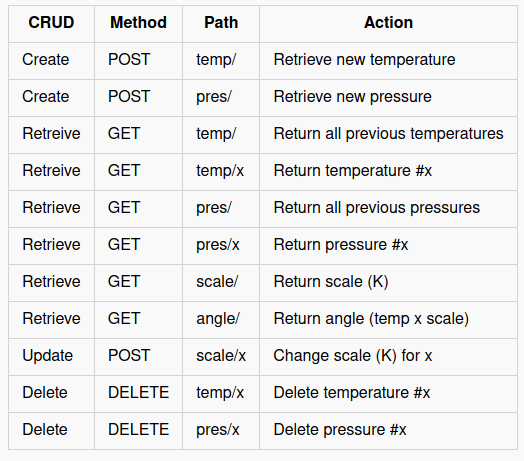


## 5.1. Interface Graphique

Avec le navigateur Google Chrome, on peut uniquement faire des GET donc pas de POST ni de DELETE qui modifient l'état du serveur. On a donc commencé par faire une page html avec des bouttons qui nous permettra de plus facilement débugger nôtre code. 

Le code de la page html est disponible [ici](/Raspberry_pi/index.html). 


Il y a un bouton pour chaque commande, une case de formulaire pour celles qui nécessitent une valeur en entrée et une zone d'affichage en bas. 


## 5.2. Communication entre la STM32 et la Raspberry PI0

Puisqu'on a pas besoin de visualiser les trammes envoyées et reçues par UART entre la STM32 et la Raspberry PI0, on peut désactiver certaines fonctionnalités comme l'Echo et simplifier les trammes envoyées. 

```c
void process_command(char *cmd)
{
	int32_t temp100;
	uint32_t press100;

	if (strcmp(cmd, "GET_T") == 0)
	{
		if (BMP280_ReadTempPressInt(&temp100, &press100) == HAL_OK)
		{
			char msg[16];
			// Format : 12.50 (température en °C)
			snprintf(msg, sizeof(msg), "%02ld.%02ld",
					temp100 / 100, temp100 % 100);

			printf("Transmitted : ");
			printf(msg);
			printf("\r\n");


			HAL_UART_Transmit(&huart4, (uint8_t*)msg, strlen(msg), HAL_MAX_DELAY);
			//            HAL_UART_Transmit(&huart4, (uint8_t*)"\r\n", 2, HAL_MAX_DELAY);
		}
	}
	else if (strcmp(cmd, "GET_P") == 0)
	{
		if (BMP280_ReadTempPressInt(&temp100, &press100) == HAL_OK)
		{
			char msg[16];
			// Format : 102300 (pression en Pa)
			snprintf(msg, sizeof(msg), "%06lu",
					press100);

			printf("Transmitted : ");
			printf(msg);
			printf("\r\n");

			HAL_UART_Transmit(&huart4, (uint8_t*)msg, strlen(msg), HAL_MAX_DELAY);
			//            HAL_UART_Transmit(&huart4, (uint8_t*)"\r\n", 2, HAL_MAX_DELAY);
		}
	}
	else
	{
		char *err = "CMD_ERR";
		HAL_UART_Transmit(&huart4, (uint8_t*)err, strlen(err), HAL_MAX_DELAY);
		//        HAL_UART_Transmit(&huart4, (uint8_t*)"\r\n", 2, HAL_MAX_DELAY);
	}
}
```

Pour le débug côté STM32, on affiche les trames reçues dans la console via un uart différent de celui consacré au Raspberry PI0. 

## 5.3. Serveur Python

Côté serveur Python, on fusionne ce qu'on a fait dans les TP précédents. On utilise la bibliothèque ```serial``` pour communiquer avec la STM32. La Raspberry PI0 lui envoie ```GET_T```

Le code du serveur python est disponibe [ici](/Raspberry_pi/hello.py). 


## 5.4. Validation

